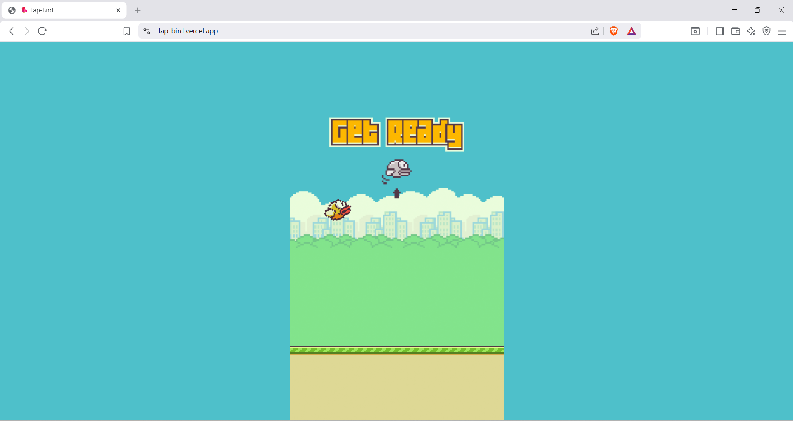

# Fap-Bird

## Introduction
Fap-Bird is a web version of the iconic Flappy Bird game released many years ago. The player controls a bird that must navigate through pipes by tapping the screen or clicking the mouse. The goal is to score as many points as possible without crashing into the pipes or falling to the ground.

## Screenshots

### Main Menu
| PC | Mobile |
| :---: | :---: |
|  |  |

### Game Over
| Mobile |
| :---: |
|  |

## Features
* **Simple Controls:** Mouse click, Touch screen, Spacebar, W, Up Arrow, or Enter.
* **Advanced Performance:** Fixed-timestep game loop and pre-rendered offscreen canvas caching for zero-lag performance on any device.
* **Dynamic Difficulty:** Aggressively tuned arcade physics where the world scroll speed increases every 5 points.
* **Visual Juice:** Screen shake and dynamic particle bursts upon pipe clearance and collisions.
* **Score Tracking:** Game over screen displays the final score alongside a locally saved Best Score.
* **Responsive Design:** GPU-accelerated CSS scaling perfectly adapts to any screen or phone size.
* **Robust Audio:** Immersive sound effects with Promise-based asynchronous asset loading.

## Demo
Play it live here: [https://fap-bird.vercel.app/](https://fap-bird.vercel.app/)

## Installation
Clone the repository to run it locally. There are no frameworks, no build tools, and no external dependencies.

```bash
git clone [https://github.com/elitepunith/Fap-bird.git](https://github.com/elitepunith/Fap-bird.git)
cd Fap-bird

```

While you can technically just open `index.html` in your browser, local file protocols (`file://`) often block audio autoplay. It is recommended to use a local static server:

```bash
npx serve .
# or
python3 -m http.server 3000

```

## Credit for assets

Graphical and audio assets inspired by the original Flappy Bird game.

```

Just copy and paste this into your `README.md`, commit it along with your `assets/screenshots/` folder, and your GitHub page will look incredibly professional! Ready to move on to modding the game code?

```